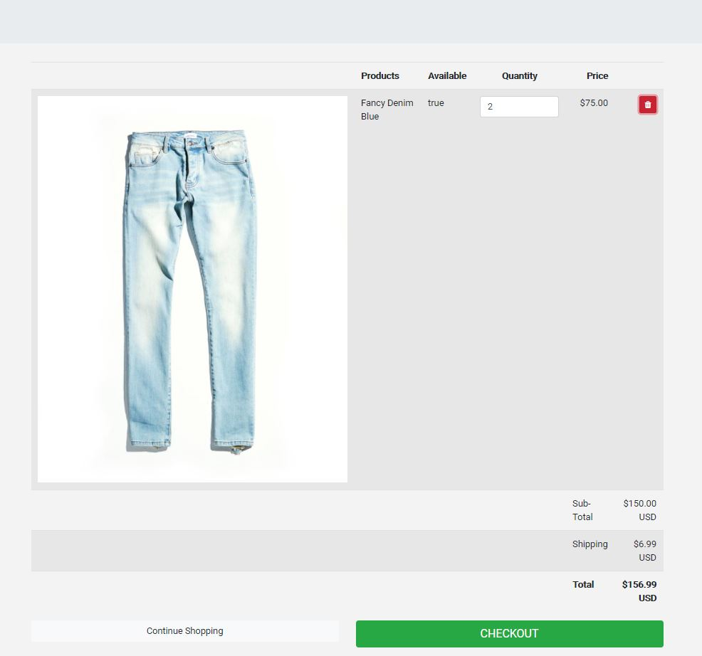
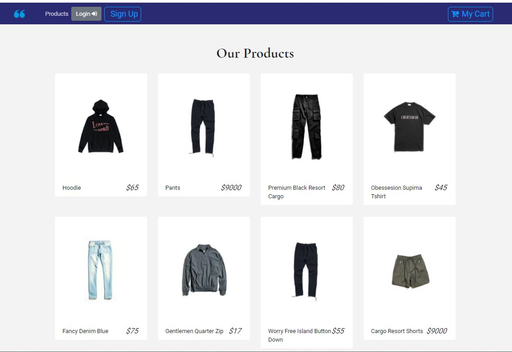

    
# Title : project-3-final

## Description
Author: Johnson Pham, Andrew D'Alba, KyleAllen, Joeseph Luca, Jivko Atanassov

Times are hard, jobs are scarce, looks like the world is ending...Fear no more "Flip-it!" is here! This revolutionary app is coming to save the world. Starting with the designer line from the web and fashion Master Johnson , and evolving into a freedom tool for the masses to sell their most coveted, mint condition , most sought after brand names. Back off "amazon" , "Flip-it" is taking the stage!

Github User names: mrjohnsonpham,joeluca24, andrewdalba,Kallen478, zhim57

## Table of Contents:
- [Title](#title)
- [Description](#description)
- [Table of Contents](#table-of-contents)
- [Installation](#installation)
- [Usage](#usage)
- [License](#licence)
- [Contributing](#contributing)
- [Tests](#tests)
- [Questions](#questions)

## Installation
npm install,npm start , or just presses the deployed app link for heroku:https://sleepy-caverns-51893.herokuapp.com/ 
## Usage
- Web development/front end
- Node.js  application
- Web development back end
- Database Application
- Productivity Application
- iOS App
- Android app
- entertainment application
- Financial App
- transportation application
- other
this is a great marketplace website , a lot of first class products.And future possibility to add your own products to the line.
## Email
andrewdalba@gmail.com , zhim57@yahoo.com
## Contributing
Johnson Pham, Andrew D'Alba, KyleAllen, Joeseph Luca, Jivko Atanassov
## License

## Tests
functionality

## Questions
please email with any questions at:
Johnson Pham, 
Andrew D'Alba : andrewdalba@gmail.com, 
KyleAllen, 
Joeseph Luca, 
Jivko Atanassov  :  zhim57@yahoo.com, 

Thank You.

## Links

[link to this portfolio](https://github.com/mrjohnsonpham/project-3-final)

[link to the deployed application](https://sleepy-caverns-51893.herokuapp.com/)
  

## Screenshots

  
